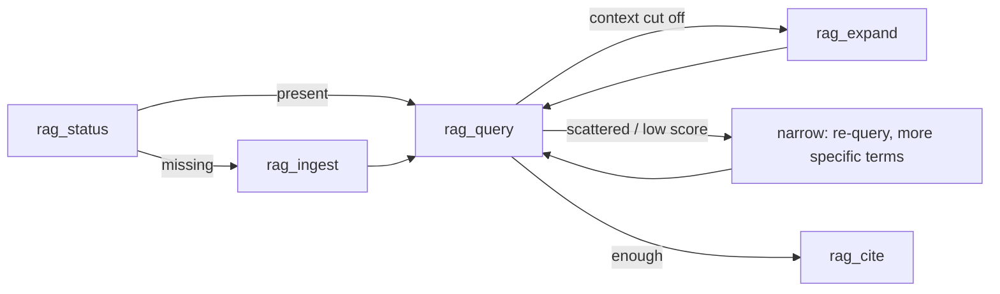

# RAG — the agent's guide to the source scrubber

**Audience:** an agent (Claude Code or Cursor) working a step that needs facts from a
corpus it did **not** write — a repo, a docs tree, a dependency's git history, a website
or wiki. **Task this doc enables:** pull slim, *cited* context from that corpus instead of
reading whole files into your window, and recurse (expand / narrow) until you have exactly
what the claim needs.

The RAG sidecar is a **deterministic program you call**, never an agent doing the reading:
same corpus + same query ⇒ byte-identical results. No embeddings, no query-time network, no
native deps. Design rationale and trade-offs live in [RAG_DESIGN.md](RAG_DESIGN.md); this
doc is the how-to.

## When to use it — and when not

Reach for RAG when the answer lives in an **external corpus** and you'd otherwise read
several files to find it:

- "How does *that* dependency handle X?" over a git you cloned.
- "What do the design docs say about the gather loop?" over a docs folder.
- Any lookup where the right file/line isn't known up front and grepping-then-reading would
  pull far more into context than the two paragraphs you need.

**Do NOT use it for** (a plain tool is cheaper and exact):

- A single known file or a one-line lookup → `Read` / `read_file_ref` it directly.
- Plan / step / lesson knowledge — that already lives in the ledger; use `recall` and
  `get_lessons`. RAG is for *external* corpora, not plan-ledger's own data.
- Sources that change every few minutes — the index is a snapshot; re-ingest has a cost.

## The six tools

All six are `mcp__plan-ledger__rag_*`. Signatures below are the shipped zod schemas
(`src/rag/tools.mjs`); every result also carries a `directive` string naming the recursive
next move.

| Tool | Purpose | Key args (defaults) |
|---|---|---|
| `rag_ingest` | Scrub a source into `codename-N` chunks | `source`, `codename?`, `type?`, `options?` |
| `rag_status` | The ingest-or-query decision | `codename?` (omit → all sources) |
| `rag_query` | THE entry point — slim hits + auto-expanded runs | `query`, `codenames?`, `limit?`=5, `expand?`=true, `threshold?`=0.35, `max_hops?`=3, `token_budget?`=2000 |
| `rag_expand` | Manually walk a chunk's neighbors | `chunk`, `direction?`=both, `count?`=1 |
| `rag_cite` | Translate chunk ids → exact source locators | `chunks[]` |
| `rag_forget` | Remove a source (or just superseded gens) | `codename`, `prune_superseded?`=false |

### `rag_ingest {source, codename?, type?, options?}`

Type is auto-detected from `source`: an existing file → `file`; an existing dir → `folder`
(or `git` if it holds a `.git`); a `*.git` or git URL → `git` (shallow clone if remote); an
`http(s)` URL → `website`, or `wiki` when its `/api.php` answers. Pass `type` to override.
`codename` must match `^[a-z0-9][a-z0-9-]*$`; omit it and one is slugged from the source's
basename. Re-ingesting the same codename supersedes the old version but keeps its chunks
resolvable for one generation, so any `codename-N` you already wrote into a step still cites.

Returns `{codename, version, type, docs, chunks, tokens_est, skipped:[{path,reason}], directive}`.

`options` (all optional): `max_file_kb` (512), `max_files` (5000), `include`/`exclude`
(globs), `max_depth` (website BFS, 3), `max_pages` (website 50 / wiki 200), `delay_ms`
(politeness, 500), `namespaces` (wiki, `[0]`), `include_log` (git: last 200 commit subjects
as one synthetic doc).

### `rag_status {codename?}`

Your first call. No codename → every source; a codename → just that one. Present with a
plausible `ingested_at` → query it. Missing → `rag_ingest` it. Returns
`{sources:[{codename, version, status, type, root, docs, chunks, tokens_est, ingested_at}], directive}`.

### `rag_query {query, codenames?, limit?, expand?, threshold?, max_hops?, token_budget?}`

The entry point. Use **2–5 informative terms, not sentences** — stopwords are dropped, so a
sentence just wastes the slot. `codenames` filters (default: all active); multi-source search
is one call. Returns:

```
{ query, terms, ranker: 'fts5'|'js',
  hits:     [{ chunk, score, locator, heading, snippet }],   // slim, always
  expanded: [{ chunks:'code-40..code-41', first, last, seqs, text, locators }],  // when expand:true
  truncated?, next?, directive }
```

`hits` are slim by design (id + score + locator + heading + snippet). `expanded` carries the
full text of the neighbor-run around each hit — but only when expansion accepted a neighbor.

### `rag_expand {chunk, direction?, count?}`

The manual recursion step. Give it a chunk id (`frontier-docs-12`, or `frontier-docs@v2-12`
to pin a superseded generation); it returns that chunk's neighbors in `direction`
(`prev`/`next`/`both`, `count` 1–5 each way). This is the call the `rag_query` `next` pointer
literally hands you. Returns `{center, chunks:[{chunk, text, locator, heading}], directive}`.

### `rag_cite {chunks[]}`

Run this before final output. It turns chunk ids into exact back-pointers
(`path#Lstart-Lend` for files/folders, `path@sha#L…` for git, `URL#anchor` for sites,
`Page§Section` for wikis). Returns
`[{chunk, codename, version, superseded, locator, doc_path, heading, source_root}]`.
A `superseded:true` entry means the source was re-ingested — re-run the query against the
active version before you ship that claim.

### `rag_forget {codename, prune_superseded?}`

Removes a codename entirely (default), or only its superseded generations
(`prune_superseded:true`). The index is disposable — re-ingest rebuilds it. Returns
`{codename, removed_versions, removed_chunks, directive}`.

## The recursive loop

The whole mechanic is: **ingest-if-missing → query for slim hits → expand a hit to grow or
narrow its neighbors → cite to translate ids back to exact sources.**



1. **Ingest-or-query.** `rag_status` first. Known & indexed → query. Missing → ingest. You
   just changed the source → re-ingest (versioning keeps old citations resolvable).
2. **Query slim.** `rag_query {query, codenames:[…]}` with 2–5 terms.
3. **Recurse:**
   - Hits look right but context feels cut off → `rag_expand` the boundary chunk (the
     payload's `next` field is the exact call to make).
   - Hits scattered across many docs / low scores → **narrow**: re-query with a more specific
     term (add an identifier you saw in a snippet).
   - Zero hits → broaden (fewer / synonym terms); still zero → wrong codename or the source
     needs ingesting (`rag_status` again).
   - Two hits in the same doc a few chunks apart → the span between them is probably
     relevant; expand from either end rather than re-querying.
4. **Cite.** Before final output, `rag_cite {chunks:[…]}` translates every id you're leaning
   on into a `path#L`/URL locator. Paste locators beside each claim.

### Worked example (real, deterministic)

Indexing this repo's own `docs/` folder and asking about the expansion rule. These are the
actual ids, scores, and locators the shipped code returns (`ranker: fts5`):

```
rag_status {}
  → pl-docs missing

rag_ingest {source:"C:/Users/AI/Documents/plan-ledger/docs", codename:"pl-docs"}
  → { codename:"pl-docs", version:1, type:"folder", docs:5, chunks:130, tokens_est:29498 }

rag_query {query:"neighbor expansion threshold stop rule", codenames:["pl-docs"]}
  → ranker:"fts5"
    hits:[
      { chunk:"pl-docs-41", score:13.28, locator:"RAG_DESIGN.md#L189-L211",
        heading:"4. THE expansion rule (the core mechanic, precisely)" },
      { chunk:"pl-docs-45", score:11.92, locator:"RAG_DESIGN.md#L260-L288", heading:"5. MCP tool surface…" },
      { chunk:"pl-docs-40", score:11.60, locator:"RAG_DESIGN.md#L183-L187", heading:"4. THE expansion rule…" } ]
    expanded:[{ chunks:"pl-docs-40..pl-docs-41", locators:["RAG_DESIGN.md#L183-L187","RAG_DESIGN.md#L189-L211"] }]

rag_cite {chunks:["pl-docs-41"]}
  → [{ chunk:"pl-docs-41", locator:"RAG_DESIGN.md#L189-L211", doc_path:"RAG_DESIGN.md", superseded:false }]
```

The two-term-heavy query landed the expansion-rule section as the top hit; expansion pulled
in its heading chunk (`pl-docs-40`); `rag_cite` translated the id back to the exact line
range you'd paste beside the claim. No file was read into context — three slim hits and one
run did it.

## Token-economy rules

The point of RAG is a *small* working context. The tools enforce that; you keep it small by
following four rules:

1. **Prefer the slim hit.** A hit is `{chunk, score, locator, heading, snippet}` — usually
   enough to know whether a chunk is worth expanding. Read the snippet before you expand.
2. **Expand only on relevance.** `rag_query` auto-expands each hit, but its walk *stops* the
   moment a neighbor stops being relevant — it does not dump the whole file. The stop rule:
   a neighbor is kept only while `rel(neighbor) ≥ threshold × rel(hit)`, walking contiguous
   chunks outward, up to `max_hops` in each direction, until the running token total would
   exceed `token_budget`. **Shipped defaults: `threshold=0.35`, `max_hops=3`,
   `token_budget=2000`** (`EXPAND_DEFAULTS`, `src/rag/expand.mjs`), all tunable per call.
   Raise `threshold` for a tighter walk, lower it to grow more.
3. **Mind the truncation marker.** When the response would blow the `token_budget`, it comes
   back with `"truncated": true` and a `"next"` field containing the exact `rag_expand` call
   to keep walking — e.g. `rag_expand {chunk:'frontier-docs-15', direction:'next'}`. That is
   your recursion pointer: call it only if the context so far was insufficient.
4. **Cite ids, not prose dumps.** Carry `codename-N` ids through your reasoning; translate to
   locators once, at the end, with `rag_cite`. Don't paste whole expanded runs into your
   report — cite the locator and move on.

## Known behavior: expansion can cross file boundaries within one source

Chunks in a folder or git source are numbered by a single contiguous `seq` across the whole
source (docs ordered by sorted `doc_path`). Expansion walks by `seq`, so a run seeded near
the end of one file **can walk into the start of the next file** inside the same codename.
This is a **characteristic, not a bug**: each chunk keeps its *own* locator, so every cited
line still points at the file it actually came from — the run just spans two `doc_path`s. The
eval surfaced this on a few end-to-end queries (design §9, limitation 4) as sub-1.0 expansion
precision. If a walk bleeds into an adjacent file you don't want, raise `threshold` (a tighter
relevance bar stops the walk sooner) or expand manually with a small `count`.

## The proof (this is measured, not asserted)

Retrieval quality is gated by an eval (`npm run eval:rag`, design §9), not by assertion. On
the committed fixture corpus (18 golden queries, 27 chunks), the shipped **BM25 ranker beats
the term-count baseline at hit@1, 94.4% vs 88.9%**, and wins on expansion precision (0.75 vs
0.69), expansion recall (0.94 vs 0.83), *and* payload economy (226 vs 256 est. tokens/query).
hit@3 saturates at 100% for all rankers on this small corpus, so hit@1 and expansion are the
sensitive metrics. FTS5 and the pure-JS BM25 fallback score identically here. Numbers are
indicative (n=18, ≈5.6 pp per query), re-derivable with `npm run eval:rag`.

## Plan-time RAG declaration (for planners)

If you're **decomposing a plan** (`/plan new`), declare the plan's knowledge up front so step
agents start grounded instead of rediscovering sources mid-step:

1. List every source the steps will need (repo folders, design docs, dependency gits,
   external sites/wikis).
2. `rag_status` → `rag_ingest` anything missing, under a **stable** codename (`frontier-docs`,
   not `plan98-docs`) so it's reusable across plans.
3. Give each step a first line in its `context` naming the source(s) + 1–3 starter queries:

   ```
   RAG: <codename> — start: "<query 1>"[; "<query 2>"[; "<query 3>"]]
   ```

   Example: `RAG: frontier-docs — start: "gather yield modifier"; "resource quality tiers"`

Step agents run those starter queries first (`rag_query`, then `rag_expand`/narrow per the
loop above) and cite chunk ids in their reports. The `RAG:` lines *are* the mapping record —
greppable via `recall`, visible in `get_context`, forwarded verbatim to the headless runner.
Parse grammar (design §10): `/^RAG:\s*(?<codename>[a-z0-9-]+)\s*—\s*start:\s*(?<queries>.+)$/m`,
queries split on `;`, each stripped of quotes.

## Both clients

The tools ride the existing stdio MCP server — zero new processes. **Claude Code** and
**Cursor** both call the same `rag_*` tool names; the loop (query → expand/narrow → cite) is
identical. In Claude Code the `/plan` skill points here; Cursor's mirror surface is on the
`cursor` branch (see [research/cursor-surface-2026-07.md](research/cursor-surface-2026-07.md)).
